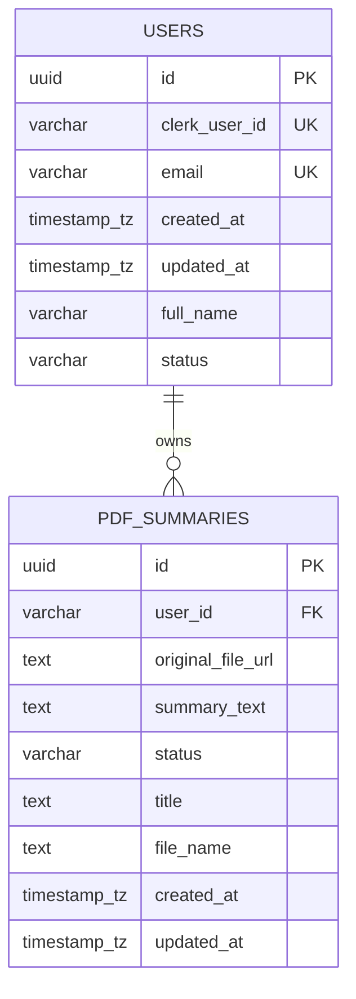
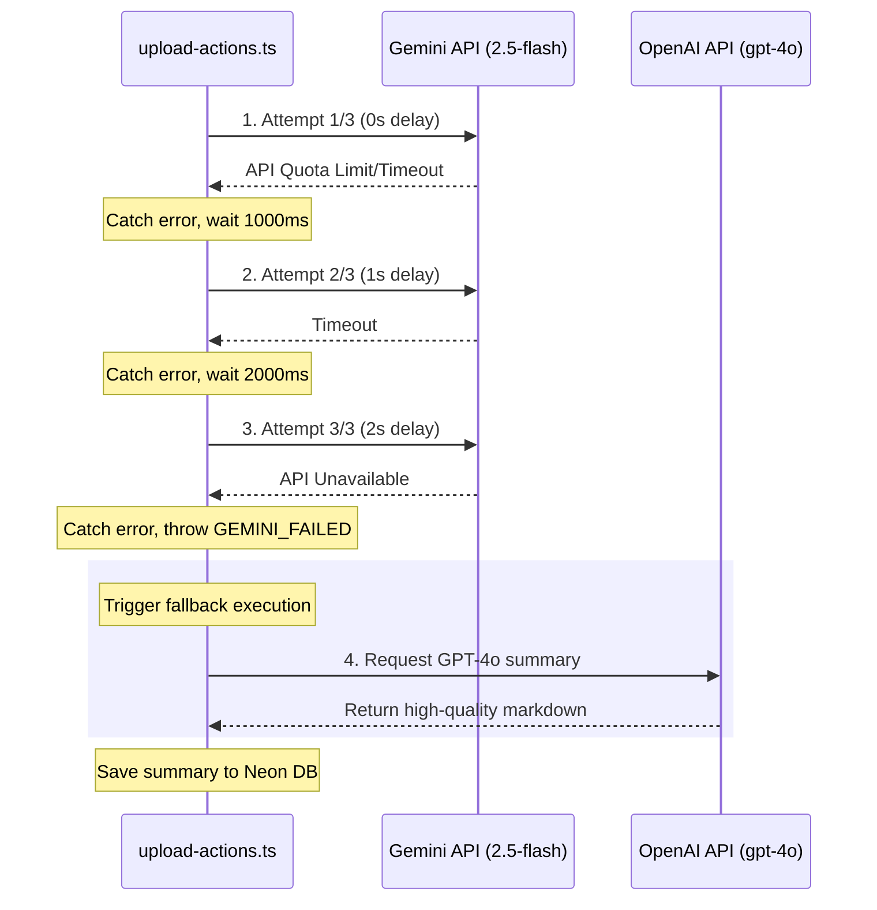

# EasyPDF v2.0: The Ultimate System Walkthrough & Architectural Encyclopedia

Welcome to the definitive, high-fidelity guide for **EasyPDF v2.0**. This document details **EVERYTHING**—what it is, why it was built, how the systems are integrated, how data flows under the hood, what technologies are utilized, and how the underlying components are mapped and structured.

---

## 🗂️ Table of Contents
1. **The Vision & Core Rationale** (*What it is & Why it exists*)
2. **Comprehensive Tech Stack Breakdown** (*What it uses*)
3. **Database Topology & Schema Integrity** (*How it is stored*)
4. **Global Workspace File Mapping** (*Where everything resides*)
5. **The Complete PDF Ingestion Pipeline** (*How it processes files*)
6. **Hierarchical Summarization & Prompt Engineering** (*How the AI reasons*)
7. **High-Availability Failover & Resiliency Engine** (*How it handles failure*)
8. **Security, SQL Rate Limits & Validation Guards** (*How it is protected*)
9. **Brutalist "Data Anarchy" Front-End & Code-Block Parser** (*How it looks & parses*)
10. **Global Lifecycles & Process Mapping** (*How it is connected*)

---

## 📄 1. The Vision & Core Rationale

### What is it?
EasyPDF v2.0 is an automated, production-grade PDF intelligence platform built with Next.js 16. It replaces slow, traditional PDF viewers with an active extraction engine that automatically takes text-based PDFs (up to 16MB), processes them hierarchically, and returns high-value briefing summaries generated by a dual-LLM structure (Gemini 2.5 Flash with fallback to OpenAI GPT-4o).

### Why does it exist?
- **Cognitive Exhaustion:** Standard documents contain endless semantic padding. Finding the thesis or extracting takeaways is manually intensive.
- **The "No-Fluff" Design Philosophy:** The application uses a hard-edged, retro-hacker **Brutalism ("Data Anarchy")** aesthetic. Stripping away smooth gradients and traditional corporate landing page mockups in favor of heavy borders, typewriter fonts, paper tilts, and high-contrast grids aligns the UI directly with the utility of the backend: extracting direct, raw, uncompromised intelligence.

---

## 🌐 2. Comprehensive Tech Stack Breakdown

EasyPDF is built entirely on a serverless, decoupled, high-speed modern stack.

| Layer | Component | Choice | Purpose |
| :--- | :--- | :--- | :--- |
| **Framework** | Next.js 16 | React Server Components (RSC), App Router, Server Actions | Provides high-speed server rendering, unified routing, and zero-API-boilerplate client/server communication. |
| **Runtime** | React 19 | Single-page lifecycle management | Handles active state management, transitions (`useTransition`), and micro-animation rendering. |
| **Auth** | Clerk | `@clerk/nextjs` | Managed, high-security cookie authentication. Intercepts endpoints at the Edge via custom middleware. |
| **Storage** | UploadThing | `uploadthing` & UT Cloud | Direct client-to-S3 storage integration. Bypasses Next.js serverless execution timeouts during file uploading. |
| **PDF Parsing** | LangChain | `@langchain/community` PDFLoader | Reads incoming file streams page-by-page in-memory on the server. |
| **Primary LLM** | Google Gemini | REST (model: `gemini-2.5-flash`) | The primary model. Provides exceptionally long context, high token speed, and very low latency. |
| **Fallback LLM** | OpenAI | `openai` library (model: `gpt-4o`) | The fallback model. High-capacity reasoning that runs automatically if Gemini experiences rate-limiting or network issues. |
| **Database** | Neon Postgres | `@neondatabase/serverless` | A serverless PostgreSQL instance. Handles immediate connection pooling over HTTP/WebSockets. |
| **Parser** | Text Splitters | `@langchain/textsplitters` | Implements recursive chunk splits with active overlaps to maintain paragraph integrity. |
| **Styles** | Tailwind CSS v4 | Utility classes + custom grids | Dictates the tactile brutalist layout, card tilt offsets, and glassmorphic frames. |
| **Primitives** | Radix UI | Radix headless primitives | Accessible underlying logic for modals, dialog triggers, and responsive states. |

---

## 🗄️ 3. Database Topology & Schema Integrity

The database layer utilizes **Neon Serverless PostgreSQL**. It is engineered for low latency with specific indexes, constraints, and operational triggers.



### Table Definitions

#### 1. `users` Table
This holds synchronized metadata from Clerk profiles to map ownership within the application ecosystem.
- `id`: Automatically generated UUID primary key (`DEFAULT uuid_generate_v4()`).
- `clerk_user_id`: Unique identifier synced from Clerk (e.g. `user_2b...`). Used as the main logical query join.
- `email`: User's primary email address (unique constraint).
- `full_name`: User's display name.
- `status`: String tracking administrative state (`active`, `suspended`).
- `created_at` & `updated_at`: Timestamps with timezones.

#### 2. `pdf_summaries` Table
Persists generated markdown summaries, source URLs, and pipeline states.
- `id`: UUID primary key.
- `user_id`: Directly maps to the user's string-based **Clerk ID** (`user_id` is index-optimized, allowing direct queries without slow SQL join lookups).
- `original_file_url`: Storage endpoint returned by UploadThing pointing directly to the original PDF.
- `summary_text`: Raw markdown document returned by the AI pipeline.
- `status`: String state tracker (`pending`, `completed`, `failed`).
- `title`: The descriptive title parsed from the AI output.
- `file_name`: The original system file name.
- `created_at` & `updated_at`: Auto-managing timezone stamps.

### Performance & DB Automations
- **Index Tuning:**
  - `idx_pdf_summaries_user_id` on `pdf_summaries(user_id)` ensures user dashboards fetch their specific document list in single-digit milliseconds.
  - `idx_pdf_summaries_created_at DESC` guarantees that feed lists load the newest briefings instantly.
- **Trigger Actions:**
  A PL/pgSQL function runs `BEFORE UPDATE` on both tables to automatically bump the target row's modification stamp:
  ```sql
  CREATE OR REPLACE FUNCTION update_updated_at_column()
  RETURNS TRIGGER AS $$
  BEGIN
      NEW.updated_at = NOW();
      RETURN NEW;
  END;
  $$ LANGUAGE plpgsql;
  ```

---

## 📂 4. Global Workspace File Mapping

Below is a complete index of every critical file in the `EasyPDF` workspace and its exact engineering purpose.

```
EasyPDF/
├── actions/
│   ├── summary-action.ts       # Server Actions for summary CRUD & stats
│   └── upload-actions.ts      # Core ingestion Server Action (Rate limit, parser, splitter, fallback)
├── app/
│   ├── (logged-in)/
│   │   ├── dashboard/
│   │   │   └── page.tsx        # Dashboard layout, card listings, stats overview
│   │   ├── summaries/
│   │   │   └── [id]/
│   │   │       └── page.tsx    # Summary detail viewer (SSR with dynamic metadata)
│   │   └── upload/
│   │       └── page.tsx        # Drag & drop upload page integration
│   ├── api/
│   │   └── uploadthing/
│   │       ├── core.ts         # UploadThing backend configurations & size constraints
│   │       └── route.ts        # Next.js API route handler for UploadThing webhooks
│   ├── layout.tsx              # Root HTML wrapper, global font configuration (Geist Mono/Sans)
│   ├── page.tsx                # High-fidelity Landing Page in Data Anarchy styling
│   └── globals.css             # Tailwind baseline & custom brutalist button styling
├── components/
│   ├── summaries/
│   │   ├── delete-all-button.tsx  # Red brutalist alert dialog button with loading states
│   │   ├── empty-summary-state.tsx # Dynamic layout shown when user has 0 summaries
│   │   ├── summary-card.tsx       # Mini dashboard cards using scrapbook tilter layouts
│   │   └── summary-viewer.tsx     # Stateful line-by-line block markdown viewer
│   └── upload/
│       ├── upload-form-input.tsx  # Radix UI and UploadThing frontend input dropzone
│       └── upload-header.tsx      # Sub-briefing panel for the upload container
├── lib/
│   ├── gemini.ts               # Google Gemini client with 3x retry loop & token caps
│   ├── neondb.ts               # Safe Serverless PostgreSQL connection pooling
│   ├── openai.ts               # OpenAI GPT-4o high-availability fallback engine
│   └── summaries.ts            # PostgreSQL query interfaces (create, fetch, rate limit check)
├── utils/
│   ├── prompts.ts              # Highly collapsed, 3-section system prompts
│   └── summary-helper.ts       # Markdown segment and emoji bullet parsing tools
├── schema.sql                  # Raw SQL database schemas, indices, and triggers
├── package.json                # Project dependencies, build targets, and runtime scripts
└── README.md                   # Clean project introduction & environment configurations
```

---

## 📥 5. The Complete PDF Ingestion Pipeline

When a user drops a PDF into the dashboard, it starts an intricate serverless lifecycle.

```
[Browser Dropzone]
       │
       ├─► 1. File verification (Must be < 16MB)
       ├─► 2. Stream raw bytes directly to UploadThing Cloud
       │      │
       │      └─► Bypasses serverless timeouts entirely
       ▼
[UploadComplete Callback]
       │
       ├─► Returns secure fileUrl (https://utfs.io/f/...) and fileName
       ▼
[Server Action: generatePdfSummary]
       │
       ├─► 1. AUTH CHECK: Read Clerk secure user session
       ├─► 2. RATE LIMIT: SQL count summaries created in last 24h
       │      └─► Count >= 10? Fail and return user rate-limit error
       ├─► 3. INGESTION: Fetch PDF URL and load into LangChain PDFLoader
       ├─► 4. READ GUARD: Extract fullText. Length < 200 chars?
       │      └─► Yes? Fail with scanned-PDF error
       ├─► 5. CHUNKING: Split text into 8,000 char chunks with 500 overlap
       ├─► 6. PIPELINE ROUTING:
       │      ├─► Single Chunk: Send chunk directly to LLM
       │      └─► Multi-Chunk: Hierarchical individual summary passes
       ▼
[LLM Processing Layer]
       │
       ├─► Dynamic target word limits computed based on text size
       ├─► Call Gemini with 3x retry loop (temperature: 0.3, maxOutputTokens: 1500)
       │      │
       │      └─► Fail? Fallback instantly to OpenAI GPT-4o
       ▼
[Database Persistence]
       │
       ├─► SQL Insert: Create record with title, URL, status='completed'
       ├─► Revalidate Next.js cache for `/dashboard`
       ▼
[Redirect user to /summaries/UUID]
```

---

## 🤖 6. Hierarchical Summarization & Prompt Engineering

Standard AI summarization fails on extensive documents because sending large amounts of text in a single prompt forces the model to ignore critical points. EasyPDF addresses this with two engineered features:

### 1. Recursive Chunking & Intermediate Synthesis
- **Chunk Tuning:** The text splitter is set to `chunkSize: 8000` with `chunkOverlap: 500`.
- **Hierarchical Loop:**
  For multi-chunk documents, the pipeline summarizes each chunk individually using a lightweight, highly focused instruction:
  > *Summarize the following section of a document in 2-3 concise bullet points (•). Be factual and specific.*
- **Unified Final Pass:**
  The server concatenates all intermediate chunk summaries (e.g. 5 chunks yield 10-15 bullet points) and uses *this* distilled text as the source document for the final prompt. This guarantees that deep technical points from page 48 are represented in the final summary.

### 2. High-Fidelity prompt constraints (`prompts.ts`)
The AI system prompt is heavily collapsed to enforce output structure, prevent token wastage, and provide high readability. The prompt constrains the model to **exactly three distinct markdown sections**:
- **Overview:** Exactly 2 paragraphs, under 150 words total, describing thesis and target audience.
- **Key Points:** 5-10 exhaustive bullet points strictly beginning with `•`, listing deep facts, data, names, and metrics.
- **Takeaway:** Exactly 1 concluding synthesis paragraph.

---

## ⚡ 7. High-Availability Failover & Resiliency Engine

Production environments require robust error handling. EasyPDF features a **transparent dual-LLM fallback architecture** that ensures users always receive summaries, even during API outages.



### Key Technical Details
- **Fail-Fast Safety:** The retry loop inside `lib/gemini.ts` catches network issues and rate limits. If it encounters authorization errors (`401` or `403`), it skips retries to fail fast and prevent wasting execution time.
- **Identical Interface Contracts:** Both `generateSummaryFromGemini` and `generateSummaryFromOpenAI` share the exact same system prompt configuration, dynamic word limits, and output formats. The transition is completely invisible to the frontend.

---

## 🛡️ 8. Security, SQL Rate Limits & Validation Guards

The application is protected against bad inputs and malicious usage with zero reliance on external rate-limiting libraries.

### 1. Pure SQL User-Based Rate Limiting
To protect OpenAI and Gemini API credits, the application queries Neon PostgreSQL prior to calling any model:
```typescript
const recentCount = await getUserSummaryCountLast24h(user.id);
if (recentCount >= 10) {
    throw new Error("Daily limit reached. You can generate up to 10 summaries per 24 hours.");
}
```
*Why SQL-based?* Redis-based rate limiters require separate paid subscriptions. Since our data is already relational, querying indexed timestamp columns in Postgres runs in under **5ms**, saving cloud infrastructure costs.

### 2. Scanned PDF Guard
If a user uploads an image, a scanned page, or an unreadable document, standard parsers return an empty text string. EasyPDF stops this prior to calling the AI pipeline:
```typescript
if (fullText.trim().length < 200) {
    throw new Error("Could not extract text — this may be a scanned or image-based PDF. Please use a text-based PDF.");
}
```
This validation is set to 200 characters (approx. 2 lines of text), acting as a clean barrier against scanned PDFs and garbage inputs.

---

## 🎨 9. Brutalist Frontend & Code-Block Parser

EasyPDF is built around a distinct, tactile visual language called **"Data Anarchy"**.

### Code-Block-Aware Line Parser
Standard markdown parsers fail if they encounter section headers (`#`) nested inside code snippets, splitting the summary box into incorrect pieces. EasyPDF solves this inside `SummaryViewer` using a custom, stateful line-by-line streaming algorithm:
- It iterates through the lines of the markdown summary.
- If it detects a triple-backtick fence (` ``` `), it toggles `inCodeBlock = true`.
- If a line begins with `#` but `inCodeBlock` is `true`, it ignores the hash for splitting and appends the line to the current block.
- If `inCodeBlock` is `false`, it splits the content cleanly into individual card containers.

### Design Tokens
- **Rotating Cards:** Individual briefings render in custom paper frames that dynamically tilt based on layout order: `${index % 2 === 0 ? '-rotate-1' : 'rotate-1'}`. Hovering scales the component smoothly (`transition-transform duration-300 hover:scale-[1.01]`).
- **Heavy Borders:** Heavy `border-4 border-black` boundaries separate components with retro retro-terminal contrast.
- **Monospace Headers:** Large headings utilize Geist Mono for a stark typewriter look, sitting over soft, high-contrast, texturized halftone background grids.

---

## 🔄 10. Global Lifecycles & Process Mapping

This diagram maps how every component inside the workspace connects during a user's upload:

```
                  ┌──────────────────────┐
                  │   User Browser UI    │◄─────────────────────────────┐
                  └──────────┬───────────┘                              │
                             │ Drop PDF File                            │
                             ▼                                          │
                  ┌──────────────────────┐                              │
                  │   UploadThing Cloud  │                              │
                  └──────────┬───────────┘                              │
                             │ File URL & Metadata                      │
                             ▼                                          │
                  ┌──────────────────────┐                              │
                  │  upload-actions.ts   │                              │
                  └──────────┬───────────┘                              │
                             │                                          │
      ┌──────────────────────┴──────────────────────┐                   │
      ▼                                             ▼                   │
┌───────────┐ Read User Session               ┌───────────┐ Read counts │
│ Clerk API │                                 │  Neon DB  │ last 24h    │
└───────────┘                                 └───────────┘             │
      │                                             │                   │
      └──────────────────────┬──────────────────────┘                   │
                             │ Approved?                                │
                             ▼                                          │
                  ┌──────────────────────┐                              │
                  │   LangChain Parser   │                              │
                  └──────────┬───────────┘                              │
                             │ Extract Text (Check >= 200 Chars)        │
                             ▼                                          │
                  ┌──────────────────────┐                              │
                  │ Recursive Splitter   │                              │
                  └──────────┬───────────┘                              │
                             │ 8,000 Char Chunks                        │
                             ▼                                          │
                  ┌──────────────────────┐                              │
                  │ Hierarchical Pass    │ (If multiple chunks)         │
                  └──────────┬───────────┘                              │
                             │ Combined Mini-Briefs                     │
                             ▼                                          │
                  ┌──────────────────────┐                              │
                  │ generateSummary      │                              │
                  └──────────┬───────────┘                              │
                             │                                          │
              ┌──────────────┴──────────────┐                           │
              │ Gemini Primary (3 Retries)  │                           │
              └──────────────┬──────────────┘                           │
                             │                                          │
                     ┌───────┴───────┐                                  │
             [SUCCESS]               [GEMINI_FAILED]                    │
                     │                       │                          │
                     ▼                       ▼                          │
             ┌──────────────┐        ┌──────────────┐                   │
             │ Save to Neon │        │ Fallback LLM │                   │
             └──────┬───────┘        │ (OpenAI GPT) │                   │
                    │                └──────┬───────┘                   │
                    │                       │                           │
                    └────────┬──────────────┘                           │
                             │                                          │
                             ▼                                          │
                  ┌──────────────────────┐                              │
                  │  /summaries/[uuid]   │──────────────────────────────┘
                  │  (SummaryViewer UI)  │ Renders custom brutalist cards
                  └──────────────────────┘
```

This completes the absolute, comprehensive architectural encyclopedia of **EasyPDF v2.0**. Every component, helper utility, API call, and database query is engineered to work in perfect unison to deliver lightning-fast, high-availability document intelligence.
